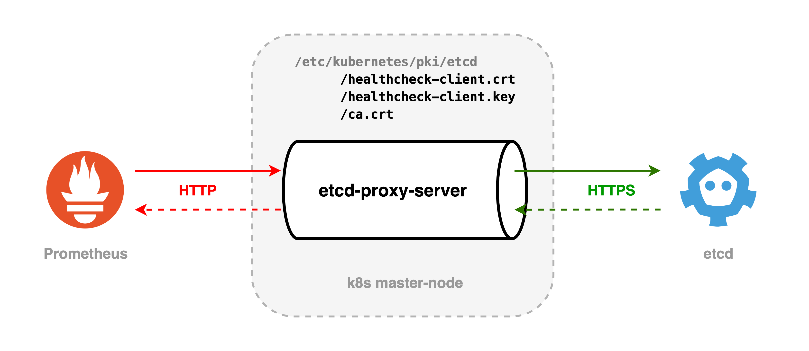

[](https://travis-ci.org/eikoshelev/etcd-proxy-server)


# etcd-proxy-server

Proxy to collect etcd metrics using Prometheus over HTTPS in a Kubernetes cluster



* Automatically deployed on master nodes ([daemonSet.yaml](kubernetes/manifests/daemonSet.yaml));
* Using certificates located in `/etc/kubernetes/pki/etcd`, configures the HTTPS client;
* Receives requests for receiving metrics and, on behalf of the configured client, refers to etcd;
* Returns received metrics;
* Allows only `GET` requests for the handler `/metrics`;

## Usage:

```
./etcd-proxy-server -h

Usage of ./etcd-proxy-server:
  -addr string
    	Server port (default ":8888")
  -caFile string
    	A PEM eoncoded CA's certificate file (default "/etc/kubernetes/pki/etcd/ca.crt")
  -certFile string
    	A PEM eoncoded certificate file (default "/etc/kubernetes/pki/etcd/healthcheck-client.crt")
  -keyFile string
    	A PEM encoded private key file (default "/etc/kubernetes/pki/etcd/healthcheck-client.key")
  -clientTimeout int
    	Timeout for client (default 10)
  -hostIP string
    	Host machine IP
  -serverRTimeout int
    	ReadTimeout for server (default 10)
  -serverWTimeout int
    	WriteTimeout for server (default 10)
```
  
`hostIP` reads the environment variable of the same name by default, which is set depending on the node on which it is deployed under, for more details see [daemonSet.yaml](kubernetes/manifests/daemonSet.yaml#L61)

## Docker container
```
docker pull eikoshelev/etcd-proxy-server
```
