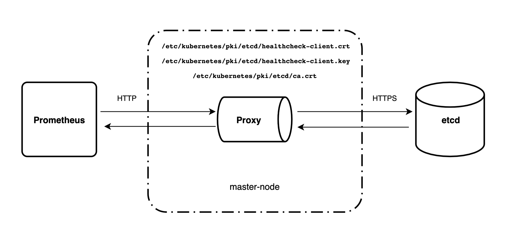

# etcd-proxy-server

Прокси для сбора метрик etcd с помощью Prometheus по протоколу HTTPS в кластере Kubernetes



* Автоматически разворачивается на мастер-нодах ([daemonSet.yaml](https://gitlab.services.mts.ru/pbrf/monitoring/etcd-proxy-server/blob/master/manifests/daemonSet.yaml));
* Используя сертификаты, расположенные в `/etc/kubernetes/pki/etcd`, конфигурирует HTTPS клиент;
* Получает запросы на получение метрик и от имени сконфигурированного клиента обращается к etcd;
* Возвращает полученные метрики;
* Разрешает только `GET` запросы по хендлеру `/metrics`;

#### Usage:

```
./etcd-proxy-server -h

Usage of ./etcd-proxy-server:
  -addr string
    	Server port (default ":8888")
  -caFile string
    	A PEM eoncoded CA's certificate file (default "/etc/kubernetes/pki/etcd/ca.crt")
  -certFile string
    	A PEM eoncoded certificate file (default "/etc/kubernetes/pki/etcd/healthcheck-client.crt")
  -keyFile string
    	A PEM encoded private key file (default "/etc/kubernetes/pki/etcd/healthcheck-client.key")
  -clientTimeout int
    	Timeout for client (default 10)
  -hostIP string
    	Host machine IP
  -serverRTimeout int
    	ReadTimeout for server (default 10)
  -serverWTimeout int
    	WriteTimeout for server (default 10)
```
  
`hostIP` по умолчанию читает одноименную переменную окружения, которая задается в зависимости от ноды, на которой развернулся под, подробнее — [daemonSet.yaml](https://gitlab.services.mts.ru/pbrf/monitoring/etcd-proxy-server/blob/master/manifests/daemonSet.yaml#L61)

